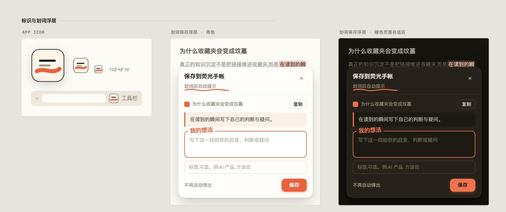
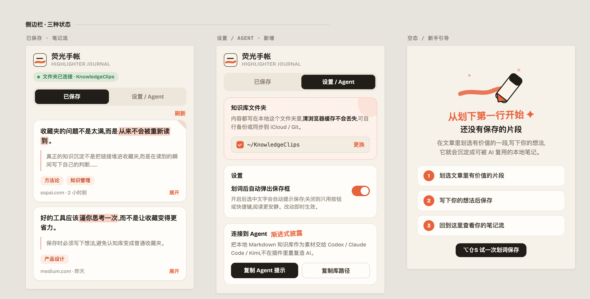

# 荧光手帐

一个本地优先的 Chrome 扩展：在网页上划词，写下自己的判断，把原文片段和想法保存成 Markdown 知识库。





## 它解决什么问题

收藏夹的问题不是太满，而是从来不会被重新读到。

荧光手帐把“看到有价值内容的瞬间”变成一张本地卡片：原文片段、页面来源、上下文、标签和你的想法会一起落到本机文件夹里。后续可以被 Codex、Claude Code、Kimi Agent、WorkBuddy 等 agent 渐进式读取，而不是把整库一次性塞进上下文。

## 主要特性

- 本地优先：通过 File System Access API 写入你亲自选择的文件夹，无账号、无服务器、无端口。
- 划词保存：选中文章片段后按 `Option+Shift+S`，或开启自动弹出保存框。
- 必写想法：保存前必须写下自己的判断，避免变成普通剪藏工具。
- Markdown 归档：同一篇文章的多次摘录会追加到同一个 `notes/*.md` 文件。
- 机器索引：同步维护 `index/clips.jsonl` 和 `index/cards.index.md`，方便 agent 检索。
- 侧边栏管理：查看、编辑、删除最近保存的片段和标签。
- 断点兜底：浏览器重启后若需重新授权，保存内容会先进入本地队列，连接后回灌。

## 安装扩展

目前适合开发者本地安装：

1. 下载或克隆本仓库。
2. 打开 `chrome://extensions/`。
3. 开启“开发者模式”。
4. 点击“加载已解压的扩展程序”。
5. 选择本仓库里的 `extension/` 目录。

首次使用：

1. 点击浏览器工具栏里的荧光手帐图标，打开右侧面板。
2. 进入「设置 / Agent」。
3. 点击「选择知识库文件夹」，选择一个本地文件夹，例如 `~/KnowledgeClips`。

内容会写入你选择的文件夹。清浏览器缓存不会删除这些 Markdown 文件；你也可以用 iCloud、Dropbox、Git 等方式自行备份。

## 使用方式

1. 打开一篇文章。
2. 选中一段有价值的内容。
3. 按 `Option+Shift+S`，或开启“划词后自动弹出保存框”。
4. 写下“我的想法”，可选填标签。
5. 点击“保存”。

保存后的文件结构：

```text
KnowledgeClips/
  notes/
    article-title-key.md
  index/
    clips.jsonl
    articles.json
    cards.index.md
  exports/
    agent-context.md
```

## 让 Agent 读取你的知识库

推荐使用渐进式披露：

1. 先读 `index/cards.index.md`，用一行一卡的目录判断哪些内容相关。
2. 再按命中的 id 或文件路径读取少量 `notes/*.md`。
3. 不要把整个 `notes/` 目录或 `index/clips.jsonl` 一次性读进上下文。

命令行辅助工具：

```bash
export KNOWLEDGE_CLIPS_DIR="$HOME/KnowledgeClips"
npm run index
npm run search -- "AI 产品"
npm run card -- "<clip id>"
npm run export:agent -- "AI 产品"
```

更多提示词和读取规则见 [AGENT_CONNECT.md](AGENT_CONNECT.md)。

## 开发

需要 Node.js 20 或更高版本。

```bash
npm run check
npm test
```

测试覆盖：

- `extension/clip-format.js` 与 `server/store.js` 的 Markdown 格式漂移守卫
- 本地文件格式的保存、编辑、删除、索引刷新
- agent 检索和导出命令

## 安全边界

- 扩展只能读写你在浏览器里选择的那个文件夹。
- 数据不上传到服务器。
- `kc-key.pem` 是用于固定扩展 ID 的本地签名私钥，已被 `.gitignore` 忽略，不应提交。
- File System Access API 主要支持 Chromium 系浏览器，例如 Chrome、Edge、Brave。

## 许可证

MIT
